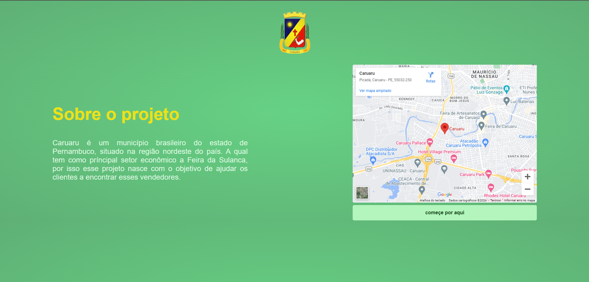

# projetoAmbulante
<h1 align="center">Ambulante</h1>

Esse projeto foi feito para ajudar as pessoas encontrem vendedores pela cidade. 

  <a href="#-tecnologias">Tecnologias</a>&nbsp;&nbsp;&nbsp;|&nbsp;&nbsp;&nbsp;
  <a href="#-projeto">Projeto</a>&nbsp;&nbsp;&nbsp;|&nbsp;&nbsp;&nbsp;
  <a href="#memo-licença">Licença</a>

  

 

 
    

## 🚀 Tecnologias

-Nesse projeto foi utilizado as seguintes tecnologias:

-React  
-Bcryptjs  
-React Router 
-Typescript 
-JS  
-HTML  
-CSS  
-Github  

## 💻 Projeto

O projeto Ambulante tem como finalidade ajudar os consumidores encontrarem vendodores que normalmente não tem local fixo ou que são desconhecidos pelo turista, além disso tem como objetivo trazer mais visibilidade para esses vendedores. 

OBS.: Esse projeto ainda não utiliza de um banco de dados, por isso se trata de um prototipo 100% fiel a ideia principal, mas ainda não conta com um Back End para mostra todos os ambulantes que forem se cadastrar no site. 

- [Visite o projeto online]()

Esse projeto está sob a licença MIT.

---

Feito com ♥ by Helena Lima

